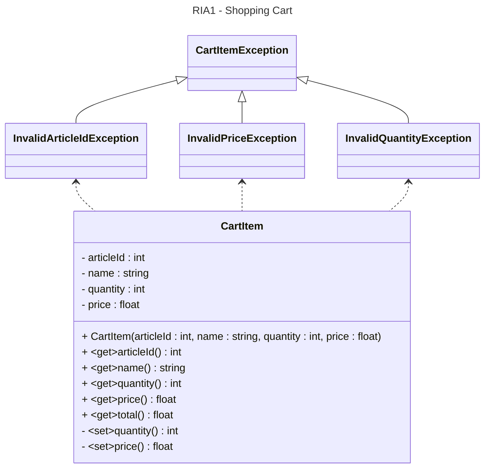

```mermaid
---
title: RIA1 - Shopping Cart
---
classDiagram
    class CartItem {
        - articleId : int
        - name : string
        - quantity : int
        - price : float

        + CartItem(articleId : int, name : string, quantity : int, price : float)
        + ~get~articleId() int
        + ~get~name() string
        + ~get~quantity() int
        + ~get~price() float
        + ~get~total() float
        - ~set~quantity() int
        - ~set~price() float
    }
    class CartItemException { }
    class InvalidArticleIdException { }
    class InvalidPriceException { }
    class InvalidQuantityException { }

    CartItemException <|-- InvalidArticleIdException
    CartItemException <|-- InvalidPriceException
    CartItemException <|-- InvalidQuantityException

    InvalidArticleIdException <.. CartItem
    InvalidPriceException <.. CartItem
    InvalidQuantityException <.. CartItem
```
