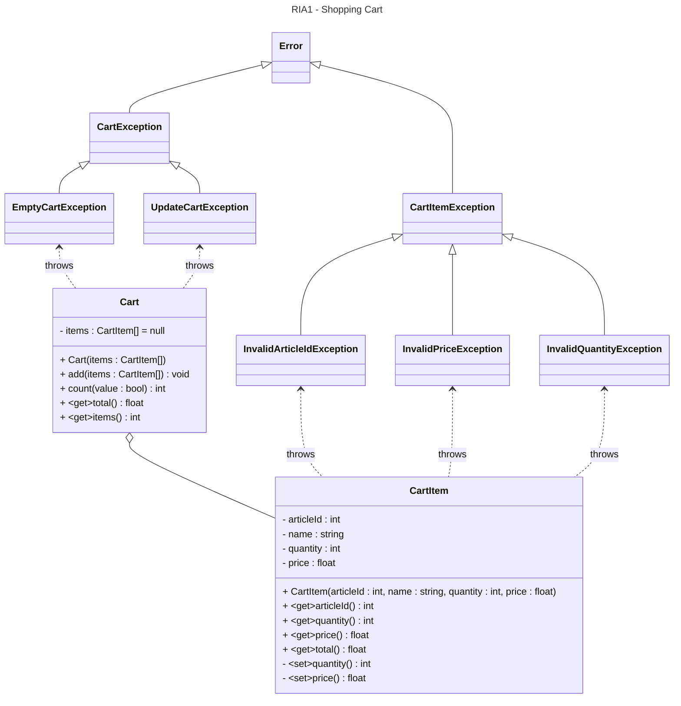

```mermaid
---
title: RIA1 - Shopping Cart
---
classDiagram
    class CartItem {
        - articleId : int
        - name : string
        - quantity : int
        - price : float

        + CartItem(articleId : int, name : string, quantity : int, price : float)
        + ~get~articleId() int
        + ~get~quantity() int
        + ~get~price() float
        + ~get~total() float
        - ~set~quantity() int
        - ~set~price() float
    }

    class Cart {
        - items : CartItem[] = null

        + Cart(items : CartItem[])
        + add(items : CartItem[]) void
        + count(value : bool) int
        + ~get~total() float
        + ~get~items() int
    }

    Cart o-- CartItem

    Error <|-- CartException
    Error <|-- CartItemException

    class CartItemException { }
    class InvalidArticleIdException { }
    class InvalidPriceException { }
    class InvalidQuantityException { }

    CartItemException <|-- InvalidArticleIdException
    CartItemException <|-- InvalidPriceException
    CartItemException <|-- InvalidQuantityException

    class CartException { }
    class EmptyCartException { }
    class UpdateCartException { }

    CartException <|-- EmptyCartException
    CartException <|-- UpdateCartException

    InvalidArticleIdException <.. CartItem : throws
    InvalidPriceException <.. CartItem : throws
    InvalidQuantityException <.. CartItem : throws

    EmptyCartException <.. Cart : throws
    UpdateCartException <.. Cart : throws
```
